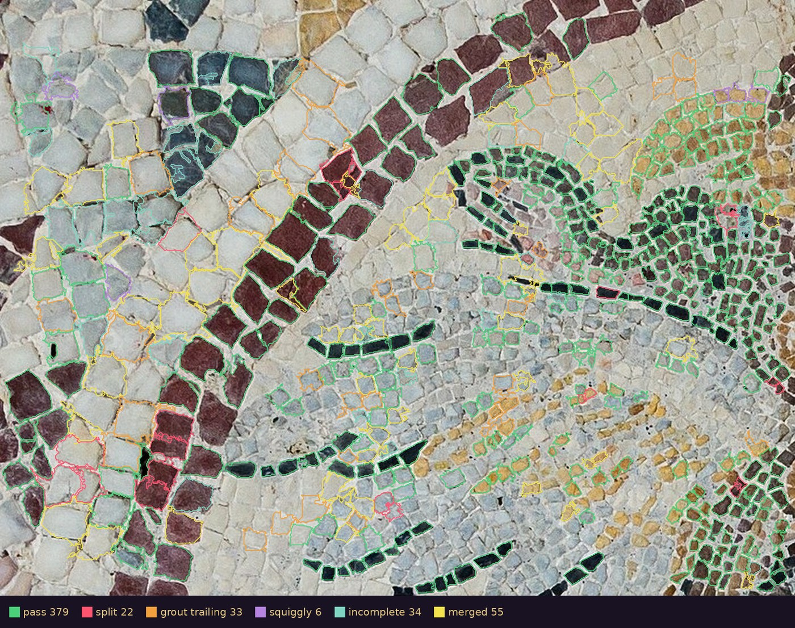

# tessera-surveyor

**Digitize a photograph of a real mosaic into per-stone data.**

Point it at a photo of a tessellated floor and it writes the floor down as
data: every stone's boundary polygon, mean color, area, aspect ratio, and
orientation, plus the measured grout color. Then it proves itself the only
way that counts — by re-rendering the floor *from the data file alone*, so
you can put the reconstruction beside the photograph and judge with your
own eyes whether the data says the floor.


*Gorgon medallion, opus tessellatum, National Archaeological Museum,
Athens (photo CC0, via Wikimedia Commons) — photograph above, and below
it the same floor re-rendered purely from its `.stones.json`:
**15,889 stones** at native 3840px resolution, one point placed in each
by a cell-segmentation model fine-tuned on this floor's own verified
outlines, every boundary drawn by a learned stopping rule. More floors,
including the one where it fails, in [examples/GALLERY.md](examples/GALLERY.md).*

## How it works: identify, spread, boundary

A survey of a floor is three questions, and `--learned` answers each
with its own instrument:

1. **Identify** — one interior point per stone. A cell-segmentation model
   places the points if you have one (`--model auto` for cellpose's stock
   weights, `--model PATH` for fine-tuned ones); without it, the gradient
   minima the mold uses, gated by the grout color so a point in mortar
   never grows mortar.
2. **Spread** — every stone grows from its point, all together, one ring
   per round, and a small network decides each candidate pixel from the
   stone's own point of view: six luminance samples along the outward
   normal relative to the stone's core, the core delta, and the gradient.
   Eight numbers in, 833 parameters, trained on human-verified outlines.
3. **Boundary** — where two pale stones collide, a second network reads
   the corridor between them from *both* sides (the ridge profile along
   the line joining the two cores) and releases what is mortar. A
   one-sided rule is weakest exactly there: measured at those collisions
   on held-out stones, the wall alone scores 0.67 and the two-sided read
   0.88.

There is no closure step. Ground the wall refused stays refused, and what
it calls mortar is the record's mortar.



*The training loop, made visible: 529 learned-wall outlines on a
860×645 region of the Gorgon medallion, each judged by eye in a purpose-
built annotator — green passed, the rest are the faults by kind. The
passes train the next wall; the merged and trailing stones, almost all
of them white on white, are the open problem. The stones were located by
a cellpose model fine-tuned on the previous round's passes, so the two
halves train each other and a human judges every turn.*

```
bin/survey photo.jpg -o out --learned                       # points from the gradient field
bin/survey photo.jpg -o out --learned --model auto --gpu    # points from cellpose
```

Inference needs only numpy, scipy and Pillow — the weights ship in
`models/` as `.npz` (9 KB and 7 KB). Training needs scikit-learn and a
verdicts file (`surveyor/learn.py PHOTO STONES.json VERDICTS.json`);
the fine-tuned cellpose weights are not in this repository (1.2 GB).

**What the wall cannot see, stated plainly.** It reads luminance, and it
learned on stone against a mortar *brighter* than the stone — the pale
lime mortar of the floors it was trained on. A joint darker than its
stones, or one that differs from them in hue alone, is invisible to it;
the mold's max-channel wall sees both, so use the mold there. And its
look-ahead is five pixels: on a photograph where a tessera is five pixels
across, it has nothing to look at (see the Tiberias segment in the
gallery). Each stone carries `"source": "model"` or `"field"` so you know
who placed its point.

## The classic survey: slime-mold the stones

The mode `bin/survey` runs without flags, and the instrument the learned
wall grew out of. Everything here is numpy, scipy, and Pillow — nothing
to download, nothing to fine-tune, every result reproducible to the
byte. It is still the better tool where the learned wall is blind (see
"What the wall cannot see" above).

1. **Locate** each stone at the minima of the color-gradient field
   (brightness thresholds are half-blind — dark stones read as grout —
   so the field is value-blind by construction).
2. **Grow** every stone outward simultaneously, one pixel ring per round,
   absorbing neighbors while the color delta stays under the stone's own
   adaptive wall; the moment it hits grout, that's the edge. A pale stone
   beside pale grout gets a tighter wall than a black stone ever needs.
   No overlap is possible: every pixel is claimed at most once.
3. **Close**: each stone then expands uniformly until it meets its
   neighbor, so the seam falls on the medial line where the grout ran —
   capped, so real lacunae stay open instead of growing lies. Colors are
   measured on the color-true extent from before closure.
4. **Trace** each stone's actual outline (Moore-neighbor boundary, CCW),
   not a convex hull: the polygon in the data is the shape in the floor.

## Install and run

```
pip install -r requirements.txt
bin/survey examples/alexander-detail.jpg -o alexander --crop 0.15,0.10,0.85,0.55 --learned
bin/survey examples/alexander-detail.jpg -o alexander --crop 0.15,0.10,0.85,0.55   # the classic mold
pytest tests/ -v
```

With cellpose installed (`pip install cellpose`), add `--model auto` to
place the points with its stock weights, or `--model PATH` for fine-tuned
ones; the surveys in this README used weights fine-tuned on the Gorgon's
verified outlines.

Four files come out:

    alexander.stones.json   the floor as data (schema below)
    alexander-digital.svg   the proof: re-rendered from the data alone
    alexander-photo.png     the analyzed image, as measured
    alexander-pixels.png    the pixel-true render: stones keep their real
                            pixels, only the grout is replaced

### Options

```
--crop X0,Y0,X1,Y1   fractions, applied FIRST at native resolution —
                     grout must stay super-pixel
--stone-px N         expected stone diameter in analyzed pixels (16)
--min-stone-px N     area floor (30)
--min-solidity F     merge gate threshold (0.55)
--max-side N         longest analyzed side (2200)
--note TEXT          provenance note carried into the output
--learned            the learned wall: identify -> spread -> boundary, with
                     a trained stopping rule and a two-sided seam read at
                     pale collisions; no closure. --model auto|PATH places
                     the points with cellpose; --no-seam skips the seam.
                     See "The learned wall" below.
--fuse               EXPERIMENTAL fused survey: a cell-segmentation model
                     (cellpose, installed separately) claims the stones it
                     is sure of — bright, well-jointed tesserae are its
                     home ground — and the mold fills every silence. Each
                     stone carries a "source" tag. Evaluation runs at half
                     scale (measured: the model's claims densify when
                     tesserae are ~8-9px in its view). Requires
                     `pip install cellpose`; refuses loudly without it.
```

## The data

```json
{
  "format": "tessera-surveyor/1",
  "method": "slime-mold",
  "grout_rgb": [168, 148, 122],
  "coverage": 1.0,
  "merged_flagged": 22,
  "joined": 0,
  "n_stones": 18387,
  "stones": [
    {"poly": [[x, y], ...], "rgb": [r, g, b], "area_px": 214,
     "wall": 38.5, "near_grout": false, "flags": [],
     "aspect": 1.41, "angle_deg": 63.5}
  ]
}
```

`poly` is the stone's traced outline in analyzed-image coordinates, wound
counter-clockwise. `wall` is the color-delta tolerance the stone grew
with; a cramped wall (`near_grout: true`) marks stones that sat close to
the grout color and may be over-split.

## Honesty as a design rule

A measuring tool must not be confidently wrong, so the failure modes are
surfaced instead of smoothed over:

- **Flags, never deletions.** A region whose hull dwarfs its pixel count
  is a merge of neighbors; a stone that grew with a cramped wall sat near
  the grout color and may be over-split; a zero-area trace is degenerate.
  All three are flagged in the record (`merged`, `near_grout`,
  `degenerate`) and the record stays — consumers choose by flag, the data
  never quietly loses a stone.
- **Lacunae stay open.** The closure step is capped, so a genuinely
  missing patch of floor stays unclaimed instead of being papered over
  by confident neighbors.
- The test suite includes a **ground-truth floor**: a synthetic tessellation
  with a known answer, against which count, color, geometry, and determinism
  are all checked. A tool that measures must be measured.

## Known limitations

Found by eye on real output, and stated because a surveyor's report is
only as good as its list of what it cannot see:

- **Lacunae are tiled.** A stripped patch — bare plaster where tesserae
  have been lost (see Alexander's shoulders) — is *smooth*, and smoothness
  is the only definition of "stone" the gradient field has. Damage
  therefore grows plausible false stones instead of reading as loss. The
  closure cap keeps unclaimed grout honest, but it cannot tell a basin of
  missing floor from a basin of stone. Until loss detection exists,
  treat stones in visibly damaged regions as suspect, and crop around
  damage when you can.
- **The count runs high.** Every minimum of the gradient field seeds a
  stone, so a textured or veined tessera can be split along its internal
  ridges: **`n_stones` is an upper bound, not a census.** The opt-in
  `--join` heals splits whose seam is provably not grout (on the
  weathered Alexander detail it recovers a large share of the over-count
  and resolves a mushy white ground into individual tesserae) — but it is
  opt-in for an honest reason: **color evidence has a ceiling.** A healed
  ridge-split and two same-colored stones touching without visible grout
  are the *same observation* — two same-colored cells, a non-grout seam —
  so a rule aggressive enough to heal a weathered figure also devours a
  pebble floor. Try it per floor and judge the render with your eyes.

## Future work — toward full accuracy

(Seed consolidation shipped as the opt-in cell join; its ceiling — see
Known limitations — is what the first three items below break through:)

- **Model fusion** shipped as `--fuse`, and the learned wall (`--learned`)
  is the road past it: the model places the points, the learned rule
  draws the stones. Next on that road: a wall that sees color as well as
  luminance, so dark-mortar and hue-only joints stop being the mold's
  alone; and a locator trained to place *one point inside each stone*
  directly, which is all the spread step ever needed.
- **Join auto-calibration by reconstruction error**: choose per-floor
  join thresholds by minimizing the pixel difference between the flat
  render and the photograph — grout is mostly one color, so grout painted
  where it shouldn't be is costly and measurable.
- **Interactive threshold viewer**: segmentation costs minutes, but a
  join decision over precomputed seams costs milliseconds — so ship the
  seam records in the data file and re-join live in a browser as a
  slider moves.
- **Loss detection**: classify smooth regions as stone vs lacuna (texture
  statistics, or a learned model), so damage is reported as damage.
- **Per-stone confidence**: every stone already carries `"conf": null` —
  the honest admission that the mold has no notion of doubt. The
  validation architecture exists in prototype (a cell-segmentation model
  certifies high-confidence stones; the gaps between them certify grout;
  agreement grades the survey) and would fill that field.
- **Scale calibration** (mm per pixel from a reference in frame), so areas
  and walls become physical measurements.
- **Count intervals**: report `n_stones` with an uncertainty band derived
  from the seed-density sensitivity, instead of a single optimistic point.

## Gallery

Six floors through the learned wall — a Roman partridge, a centaur, the
Alexander Mosaic, and the Tiberias segment where the wall's resolution
runs out — with the classic mold's count beside each, in
[examples/GALLERY.md](examples/GALLERY.md); sources and licenses in
[examples/PROVENANCE.md](examples/PROVENANCE.md).

## Provenance

AI-authored, human-directed: written by **Paean-AI**, with Sebastian Kane directing, August 2026. Issues and PRs are read by both.
See AUTHORS.

## License

MIT — see LICENSE. The example photograph is public domain (Wikimedia
Commons); its details are noted in examples/PROVENANCE.md.
