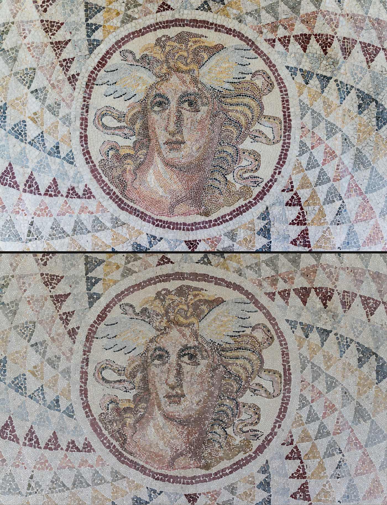

# tessera-surveyor

**Digitize a photograph of a real mosaic into per-stone data.**

Point it at a photo of a tessellated floor and it writes the floor down as
data: every stone's boundary polygon, mean color, area, aspect ratio, and
orientation, plus the measured grout color. Then it proves itself the only
way that counts — by re-rendering the floor *from the data file alone*, so
you can put the reconstruction beside the photograph and judge with your
own eyes whether the data says the floor.



*Gorgon medallion, opus tessellatum, National Archaeological Museum,
Athens (photo CC0, via Wikimedia Commons) — photograph above, and below
it the same floor re-rendered purely from its `.stones.json`:
**58,058 stones** measured in tiled mode at native 3840px resolution,
100% coverage — grout color and stone walls calibrated locally per tile.
More floors — including where the tool fails — in
[examples/GALLERY.md](examples/GALLERY.md).*

## The algorithm: slime-mold the stones

Everything here is numpy, scipy, and Pillow — nothing to download, nothing
to fine-tune, every result reproducible to the byte.

1. **Locate** each stone at the minima of the color-gradient field
   (brightness thresholds are half-blind — dark stones read as grout —
   so the field is value-blind by construction).
2. **Grow** every stone outward simultaneously, one pixel ring per round,
   absorbing neighbors while the color delta stays under the stone's own
   adaptive wall; the moment it hits grout, that's the edge. A pale stone
   beside pale grout gets a tighter wall than a black stone ever needs.
   No overlap is possible: every pixel is claimed at most once.
3. **Close**: each stone then expands uniformly until it meets its
   neighbor, so the seam falls on the medial line where the grout ran —
   capped, so real lacunae stay open instead of growing lies. Colors are
   measured on the color-true extent from before closure.
4. **Trace** each stone's actual outline (Moore-neighbor boundary, CCW),
   not a convex hull: the polygon in the data is the shape in the floor.

## Install and run

```
pip install -r requirements.txt
bin/survey examples/alexander-detail.jpg -o alexander --crop 0.15,0.10,0.85,0.55
pytest tests/ -v
```

Four files come out:

    alexander.stones.json   the floor as data (schema below)
    alexander-digital.svg   the proof: re-rendered from the data alone
    alexander-photo.png     the analyzed image, as measured
    alexander-pixels.png    the pixel-true render: stones keep their real
                            pixels, only the grout is replaced

### Options

```
--crop X0,Y0,X1,Y1   fractions, applied FIRST at native resolution —
                     grout must stay super-pixel
--stone-px N         expected stone diameter in analyzed pixels (16)
--min-stone-px N     area floor (30)
--min-solidity F     merge gate threshold (0.55)
--max-side N         longest analyzed side (2200)
--note TEXT          provenance note carried into the output
```

## The data

```json
{
  "format": "tessera-surveyor/1",
  "method": "slime-mold",
  "grout_rgb": [168, 148, 122],
  "coverage": 1.0,
  "merged_flagged": 22,
  "joined": 0,
  "n_stones": 18387,
  "stones": [
    {"poly": [[x, y], ...], "rgb": [r, g, b], "area_px": 214,
     "wall": 38.5, "near_grout": false, "flags": [],
     "aspect": 1.41, "angle_deg": 63.5}
  ]
}
```

`poly` is the stone's traced outline in analyzed-image coordinates, wound
counter-clockwise. `wall` is the color-delta tolerance the stone grew
with; a cramped wall (`near_grout: true`) marks stones that sat close to
the grout color and may be over-split.

## Honesty as a design rule

A measuring tool must not be confidently wrong, so the failure modes are
surfaced instead of smoothed over:

- **Flags, never deletions.** A region whose hull dwarfs its pixel count
  is a merge of neighbors; a stone that grew with a cramped wall sat near
  the grout color and may be over-split; a zero-area trace is degenerate.
  All three are flagged in the record (`merged`, `near_grout`,
  `degenerate`) and the record stays — consumers choose by flag, the data
  never quietly loses a stone.
- **Lacunae stay open.** The closure step is capped, so a genuinely
  missing patch of floor stays unclaimed instead of being papered over
  by confident neighbors.
- The test suite includes a **ground-truth floor**: a synthetic tessellation
  with a known answer, against which count, color, geometry, and determinism
  are all checked. A tool that measures must be measured.

## Known limitations

Found by eye on real output, and stated because a surveyor's report is
only as good as its list of what it cannot see:

- **Lacunae are tiled.** A stripped patch — bare plaster where tesserae
  have been lost (see Alexander's shoulders) — is *smooth*, and smoothness
  is the only definition of "stone" the gradient field has. Damage
  therefore grows plausible false stones instead of reading as loss. The
  closure cap keeps unclaimed grout honest, but it cannot tell a basin of
  missing floor from a basin of stone. Until loss detection exists,
  treat stones in visibly damaged regions as suspect, and crop around
  damage when you can.
- **The count runs high.** Every minimum of the gradient field seeds a
  stone, so a textured or veined tessera can be split along its internal
  ridges: **`n_stones` is an upper bound, not a census.** The opt-in
  `--join` heals splits whose seam is provably not grout (on the
  weathered Alexander detail it recovers a large share of the over-count
  and resolves a mushy white ground into individual tesserae) — but it is
  opt-in for an honest reason: **color evidence has a ceiling.** A healed
  ridge-split and two same-colored stones touching without visible grout
  are the *same observation* — two same-colored cells, a non-grout seam —
  so a rule aggressive enough to heal a weathered figure also devours a
  pebble floor. Try it per floor and judge the render with your eyes.

## Future work — toward full accuracy

(Seed consolidation shipped as the opt-in cell join; its ceiling — see
Known limitations — is what the first three items below break through:)

- **Model fusion**: use a cell-segmentation model (Cellpose) as ground
  truth in the color ranges it demonstrably handles — it reads bright,
  well-jointed regions with higher fidelity than the mold — and let the
  value-blind growth cover the dark where the model is silent. The
  validation prototype exists; fusing them is the single largest accuracy
  win available.
- **Join auto-calibration by reconstruction error**: choose per-floor
  join thresholds by minimizing the pixel difference between the flat
  render and the photograph — grout is mostly one color, so grout painted
  where it shouldn't be is costly and measurable.
- **Interactive threshold viewer**: segmentation costs minutes, but a
  join decision over precomputed seams costs milliseconds — so ship the
  seam records in the data file and re-join live in a browser as a
  slider moves.
- **Loss detection**: classify smooth regions as stone vs lacuna (texture
  statistics, or a learned model), so damage is reported as damage.
- **Per-stone confidence**: every stone already carries `"conf": null` —
  the honest admission that the mold has no notion of doubt. The
  validation architecture exists in prototype (a cell-segmentation model
  certifies high-confidence stones; the gaps between them certify grout;
  agreement grades the survey) and would fill that field.
- **Scale calibration** (mm per pixel from a reference in frame), so areas
  and walls become physical measurements.
- **Count intervals**: report `n_stones` with an uncertainty band derived
  from the seed-density sensitivity, instead of a single optimistic point.

## Gallery

Seven more floors — Pella pebble work through a Tiberias synagogue
segment, plus the Alexander Mosaic with its damage-tiling failure visible
— in [examples/GALLERY.md](examples/GALLERY.md), with sources and
licenses in [examples/PROVENANCE.md](examples/PROVENANCE.md).

## Provenance

AI-authored, human-directed: written by **Paean-AI**, with Sebastian Kane directing, August 2026. Issues and PRs are read by both.
See AUTHORS.

## License

MIT — see LICENSE. The example photograph is public domain (Wikimedia
Commons); its details are noted in examples/PROVENANCE.md.
