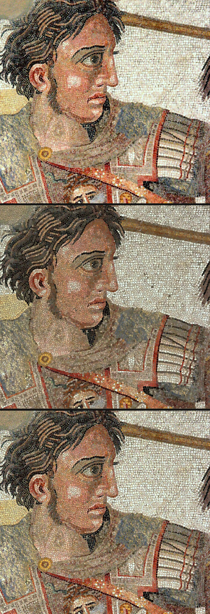
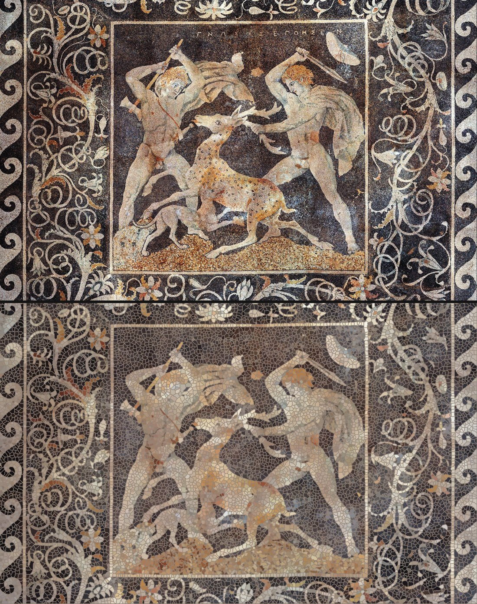
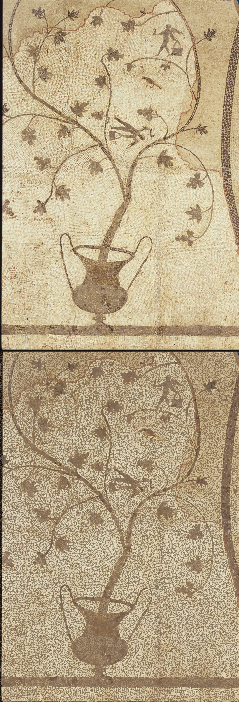
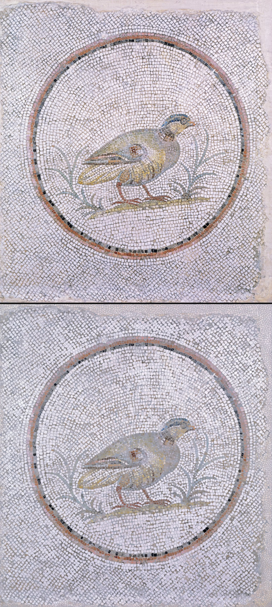
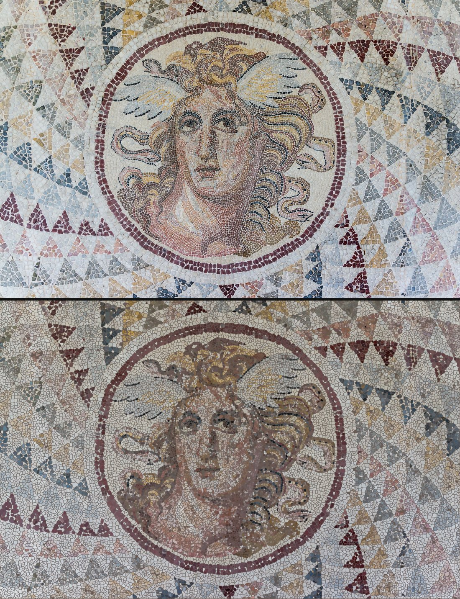
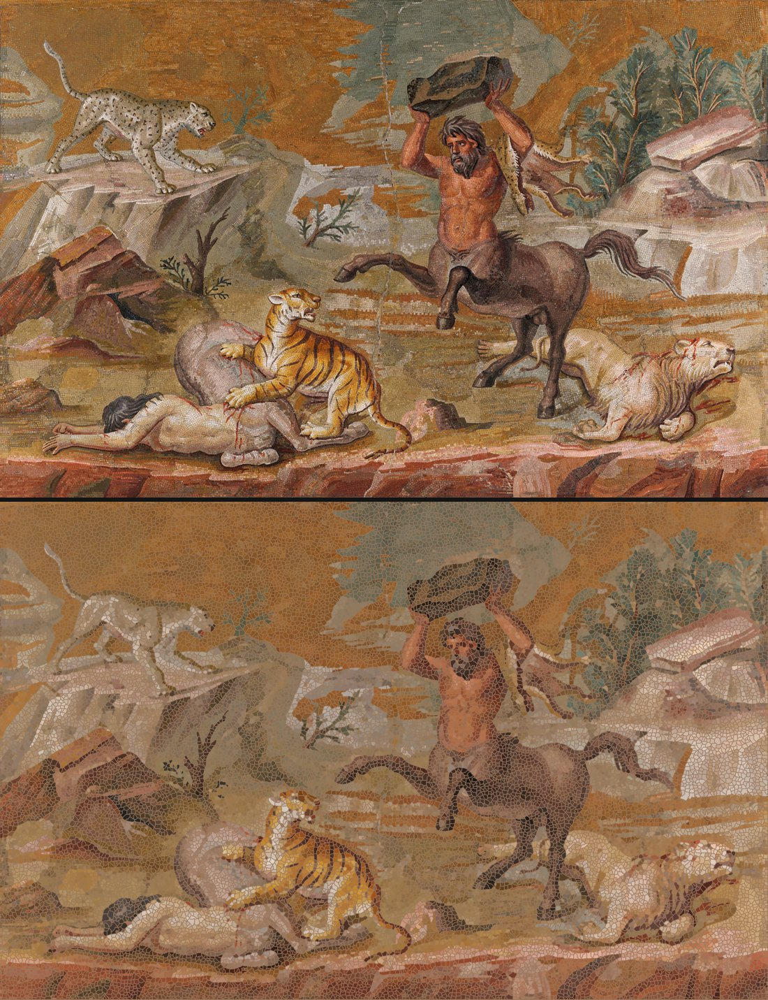
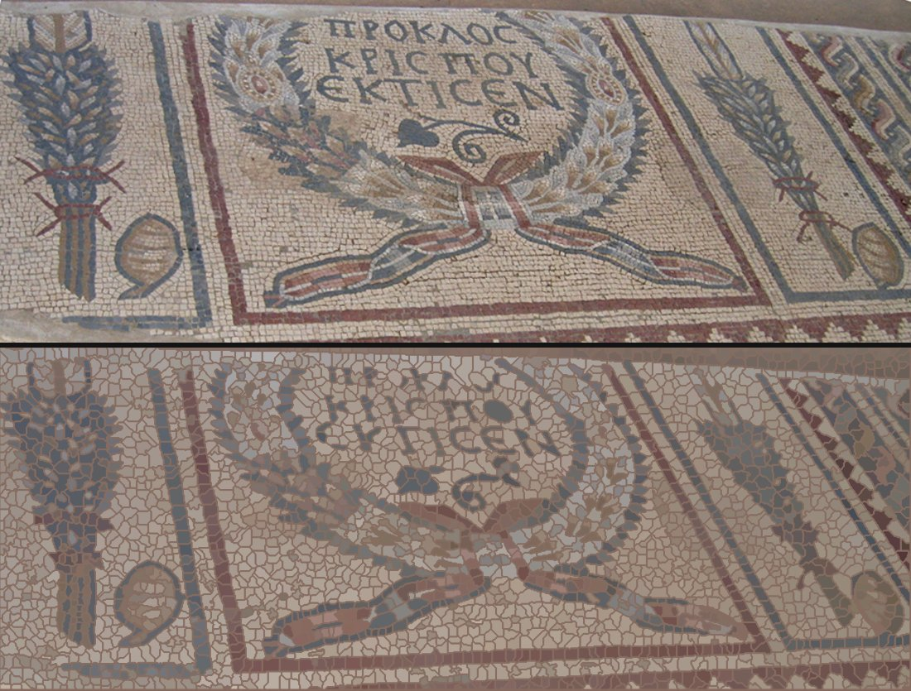

# Gallery

Each image pairs the source photograph (top) with the surveyor's
reconstruction rendered purely from its own `.stones.json` (bottom).
Sources and licenses in [PROVENANCE.md](PROVENANCE.md).

## Gorgon medallion, NAMA Athens — the headline result

58,058 stones surveyed in tiled mode at native 3840px resolution —
12 tiles, each calibrating grout color and stone walls locally, seams
deduped by centroid-in-core. The photo is not shipped for size; fetch it
from the Commons link in PROVENANCE.md and reproduce with:

    bin/survey gorgon.jpg -o gorgon --tile

## Alexander Mosaic (detail), House of the Faun, Pompeii

18,387 stones. Three panels: photograph, data-only reconstruction, and
the pixel-true render. **Look at the shoulders**: the stripped patches
(lost tesserae) are tiled with plausible false stones — this is the
lacuna limitation from the README, kept here on purpose.

## Stag Hunt, Pella (pebble mosaic, c. 300 BC)

13,253 stones. A different tradition — natural pebbles, not cut tesserae —
and the same value-blind growth reads it.

## Floor mosaic (Google Art Project)

32,750 stones.

## Partridge, Walters Art Museum

20,373 stones, 423 merges flagged — fine white ground with sub-pixel
joints, the merge gate's busiest day in this set.

## Gorgon medallion at reduced resolution

22,961 stones at the default `--max-side 2200` — compare with the
headline result above to see what native resolution buys: the same floor,
three times the stones resolved.

## Centaur mosaic, Altes Museum Berlin

27,692 stones.

## Synagogue floor segment, Tiberias

2,961 stones.

