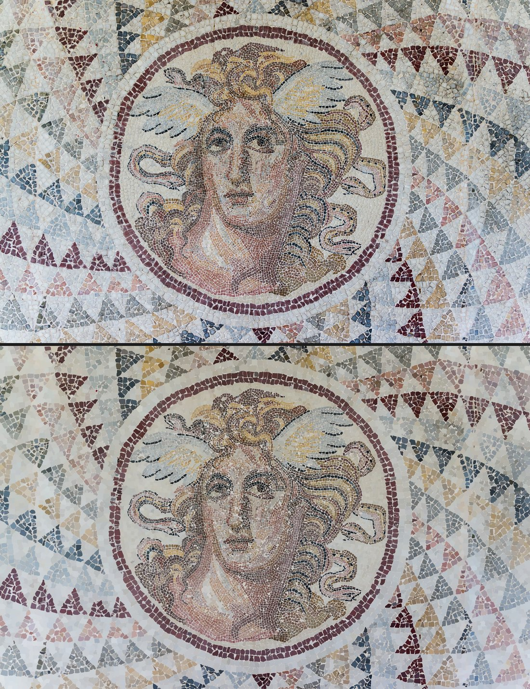
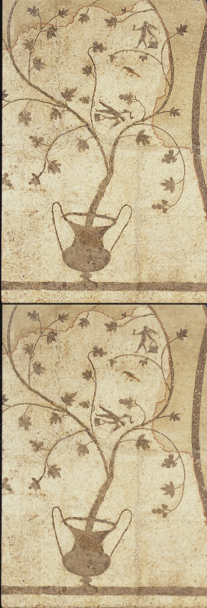
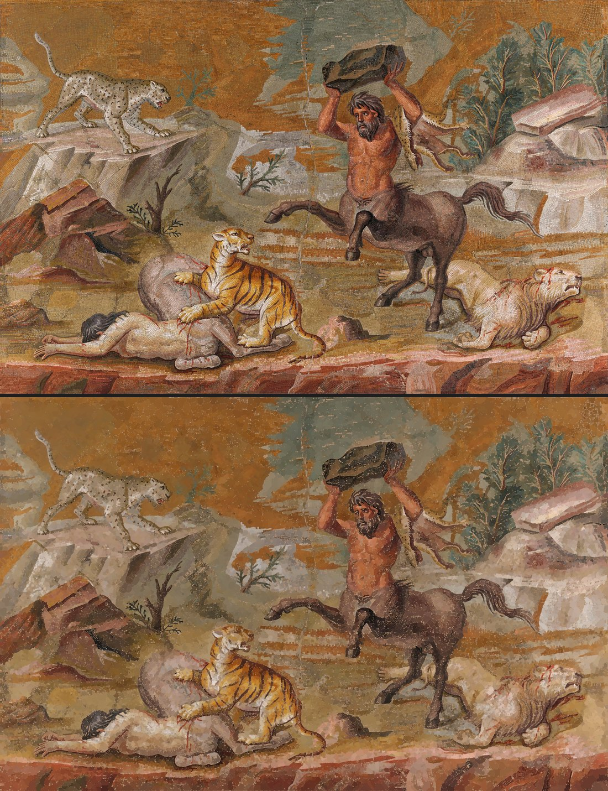

# Gallery

Each image pairs the source photograph (top) with the surveyor's
reconstruction rendered purely from its own `.stones.json` (bottom).
Sources and licenses in [PROVENANCE.md](PROVENANCE.md).

## Gorgon medallion, NAMA Athens — the headline result

58,058 stones surveyed in tiled mode at native 3840px resolution —
12 tiles, each calibrating grout color and stone walls locally, seams
deduped by centroid-in-core. The photo is not shipped for size; fetch it
from the Commons link in PROVENANCE.md and reproduce with:

    bin/survey gorgon.jpg -o gorgon --tile

## Alexander Mosaic (detail), House of the Faun, Pompeii

18,387 stones. Three panels: photograph, data-only reconstruction, and
the pixel-true render. **Look at the shoulders**: the stripped patches
(lost tesserae) are tiled with plausible false stones — this is the
lacuna limitation from the README, kept here on purpose.

## Floor mosaic (Google Art Project)

32,750 stones.

## Partridge, Walters Art Museum

20,373 stones, 423 merges flagged — fine white ground with sub-pixel
joints, the merge gate's busiest day in this set.

## Gorgon medallion at reduced resolution

22,961 stones at the default `--max-side 2200` — compare with the
headline result above to see what native resolution buys: the same floor,
three times the stones resolved.

## Centaur mosaic, Altes Museum Berlin

27,692 stones.

## Synagogue floor segment, Tiberias

2,961 stones.

# The learned wall, floor by floor

The same six floors surveyed with `--learned`, points placed by the
fine-tuned cellpose model (`--model PATH --gpu`), at native resolution up
to 4000px on the long side. Photograph above, reconstruction from the
data alone below. The mold's count for the same floor is given beside
each; the mold seeds every gradient minimum, so its count is an upper
bound, while the learned survey places one point per stone the model
sees — closer to a census, and where it is wrong it is wrong by
*missing* a stone (its ground goes to a neighbour or stays unclaimed),
never by inventing one.

    bin/survey floor.jpg -o floor --learned --model PATH --gpu --max-side 4000

## Gorgon medallion, NAMA Athens

15,889 stones (the mold: 58,058), coverage 83%. On the 860×645 region
that trained the wall, a human judged 529 of these outlines: 379 clean
passes, 55 merged, 33 trailing into mortar — almost all of the faults
white on white.

## Alexander Mosaic (detail)

8,578 stones (the mold: 18,387), coverage 83%. The white ground resolves
into tesserae instead of a mush; the weathered gold of the cuirass does
not, and that is the floor, not the tool — the stones there are worn to
one surface.

## Floor mosaic (Google Art Project)

38,902 stones (the mold: 32,750), coverage 95%. The one floor where the
learned count is higher: fine, regular, well-jointed white ground the
model reads stone by stone.

## Partridge, Walters Art Museum

9,435 stones (the mold: 20,373, with 423 merges flagged). The sub-pixel
white joints that were the merge gate's busiest day resolve here into
individual stones — 19,307 pale collisions read from both sides.

## Centaur mosaic, Altes Museum Berlin

27,623 stones (the mold: 27,692). The two methods agree within a
quarter of a percent on this floor.

## Synagogue floor segment, Tiberias — where it fails

1,042 stones (the mold: 2,961). The photograph is 943 pixels wide and a
tessera is about five pixels across: the wall's five-pixel look-ahead has
nothing to look at, the model places a point in one stone in three, and
the result is regions, not stones. Below the wall's resolution the mold
is the better instrument. Kept here on purpose.

