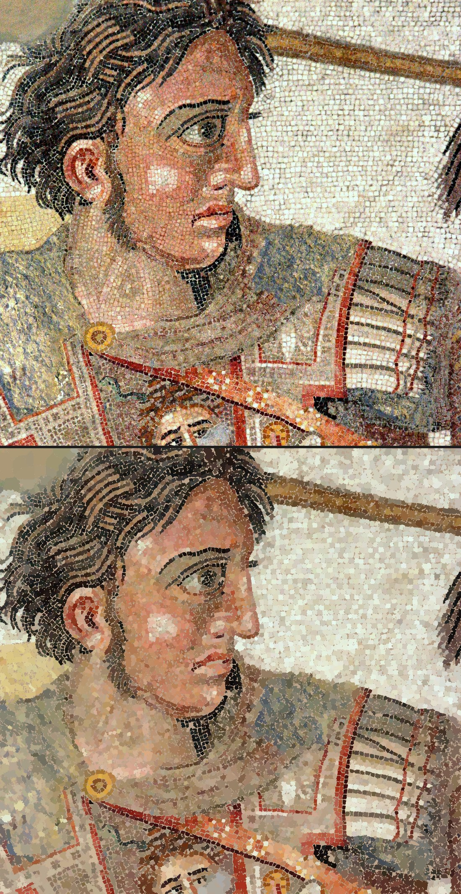
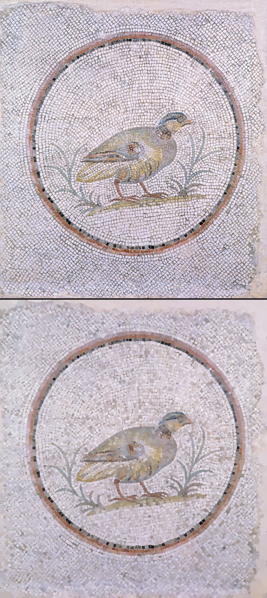
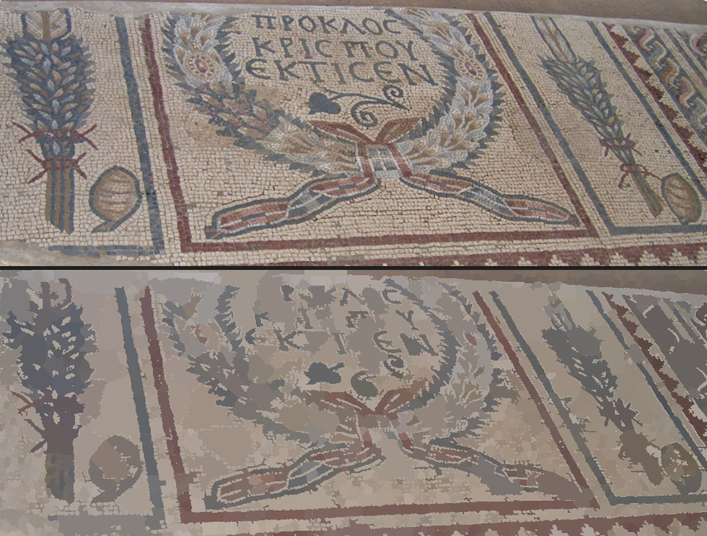

# Gallery

Six floors surveyed with the learned wall (`--learned`), points placed by
a cellpose model fine-tuned on the Gorgon's verified outlines, at native
resolution up to 4000px on the long side. Each image pairs the source
photograph (top) with the reconstruction rendered purely from its own
`.stones.json` (bottom). Sources and licenses in [PROVENANCE.md](PROVENANCE.md).

    bin/survey floor.jpg -o floor --learned --model PATH --gpu --max-side 4000

The classic mold's count for the same floor is given beside each. The
mold seeds every gradient minimum, so its count is an upper bound; the
learned survey places one point per stone the model sees, so its count
is nearer a census, and where it is wrong it is wrong by *missing* a
stone (its ground goes to a neighbour or stays unclaimed), never by
inventing one.

## Gorgon medallion, NAMA Athens

15,889 stones (the mold: 58,058), coverage 83%. On the 860×645 region
that trained the wall, a human judged 529 of these outlines: 379 clean
passes, 55 merged, 33 trailing into mortar — almost all of the faults
white on white. That batch is the picture in the README.

## Alexander Mosaic (detail), House of the Faun, Pompeii

8,578 stones (the mold: 18,387), coverage 83%. The white ground resolves
into tesserae instead of a mush; the weathered gold of the cuirass does
not, and that is the floor, not the tool — the stones there are worn to
one surface. **Look at the shoulders**: stripped patches where tesserae
are lost still read as stone, the lacuna limitation from the README.

## Floor mosaic (Google Art Project)

38,902 stones (the mold: 32,750), coverage 95%. The one floor where the
learned count is higher: fine, regular, well-jointed white ground the
model reads stone by stone.

## Partridge, Walters Art Museum

9,435 stones (the mold: 20,373, with 423 merges flagged). The sub-pixel
white joints that were the merge gate's busiest day resolve here into
individual stones — 19,307 pale collisions read from both sides.

## Centaur mosaic, Altes Museum Berlin

27,623 stones (the mold: 27,692). The two methods agree within a
quarter of a percent on this floor.

## Synagogue floor segment, Tiberias — where it fails

1,042 stones (the mold: 2,961). The photograph is 943 pixels wide and a
tessera is about five pixels across: the wall's five-pixel look-ahead has
nothing to look at, the model places a point in one stone in three, and
the result is regions, not stones. Below the wall's resolution the mold
is the better instrument. Kept here on purpose.

